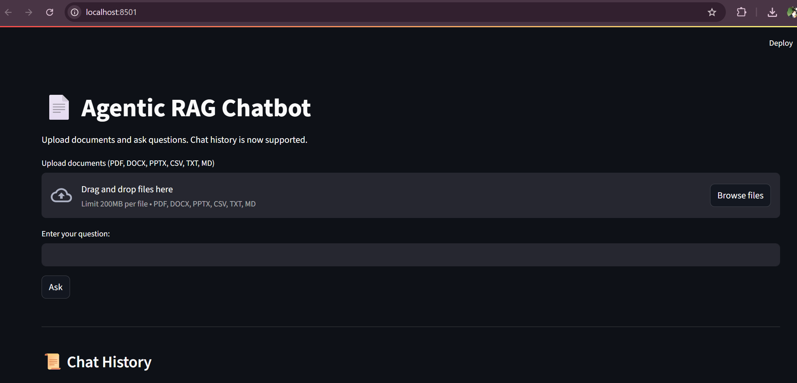
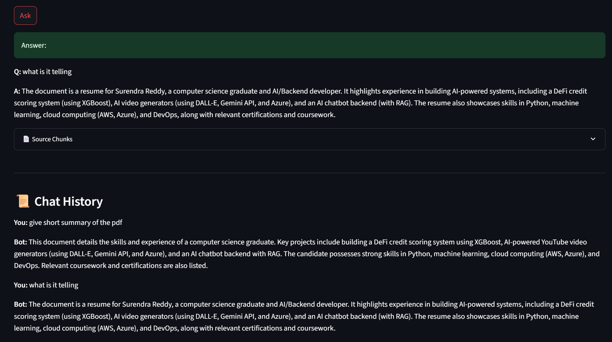
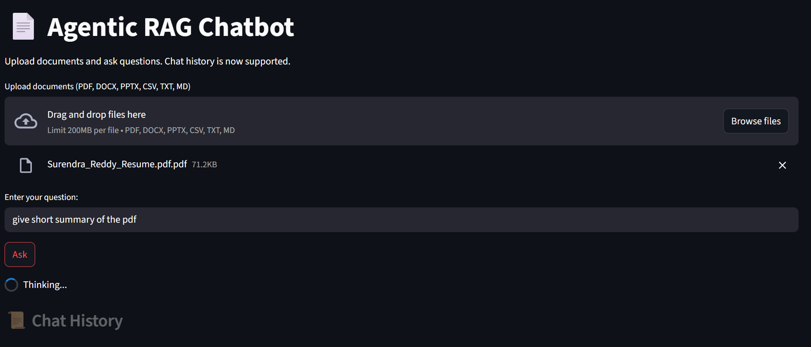
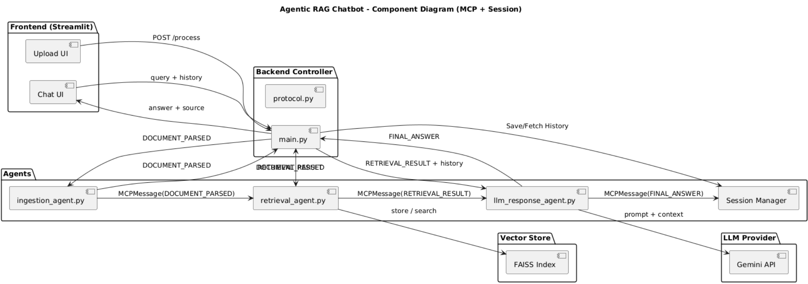

# Agentic RAG Chatbot for Multi-Format Document QA

This project is a Retrieval-Augmented Generation (RAG) chatbot built with a multi-agent architecture. It is designed to answer user queries based on uploaded documents of various formats. The system uses a structured message-passing protocol (Model Context Protocol - MCP) between the agents to maintain modularity and traceability.

The application supports multiple file types including PDFs, DOCX, PPTX, CSV, TXT, and Markdown. It includes a clean UI for uploading files and chatting with the assistant, and supports multi-turn conversation with context memory.

## Features

- Upload and parse diverse document formats: PDF, DOCX, PPTX, CSV, TXT, and Markdown
- Embedding and retrieval of document chunks using HuggingFace MiniLM and FAISS
- Uses Gemini API (Google) to generate context-aware answers
- Agentic design with clear separation of responsibilities
- Multi-turn chat history support to handle follow-up questions
- Built-in session management using Streamlit's native state
- Simple and intuitive user interface

## Architecture Overview

The architecture follows an agent-based flow:

- Ingestion Agent: Parses and preprocesses documents
- Retrieval Agent: Splits content into chunks, generates embeddings, and retrieves relevant ones
- LLM Response Agent: Builds the final prompt using retrieved content and past chat history, then queries Gemini

Communication between agents is handled via a structured format called Model Context Protocol (MCP). Each step wraps input and output in consistent message objects that include sender, receiver, payload, type, and a trace ID.

## Technology Stack

- FastAPI for the backend agent coordination and API
- Streamlit for the front-end user interface
- LangChain for document ingestion, splitting, and embedding
- HuggingFace MiniLM for text embedding
- FAISS for fast vector-based semantic search
- Gemini-Pro API from Google for response generation

## UI Screenshots

Below are placeholders for inserting screenshots of the application interface:

Home Page  
  

Chat Interface Showing Answer and Source Chunks  
 

Searching Answer From The Given File
 

## System Flow Diagram
component diagram that shows how each part of the system interacts:



This should include:
- Streamlit UI components
- FastAPI endpoint
- Each agent (Ingestion, Retrieval, LLMResponse)
- FAISS vector store
- Gemini API
- MCP message flow between each step

## How to Run

1. Clone the repository:
```
git clone https://github.com/surendrareddy235/Agentic_Rag_with_MCP.git
cd agentic-rag-chatbot
```

2. Create a virtual environment and activate it:
```
python -m venv venv
venv\Scripts\activate   (for Windows)
source venv/bin/activate   (for Mac/Linux)
```

3. Install dependencies:
```
pip install -r requirements.txt
```

4. Add your Gemini API key in a `.env` file:
```
GEMINI_API_KEY=your_google_api_key
```

5. Start the FastAPI backend:
```
uvicorn api.main:app --reload
```

6. Open a second terminal and start the Streamlit frontend:
```
streamlit run ui/app.py
```

7. Open the browser and go to:
```
http://localhost:8501
```

## How It Works

- The user uploads one or more files and asks a question through the UI.
- The backend parses the files using the Ingestion Agent.
- The parsed content is passed to the Retrieval Agent, which chunks the content and performs semantic search.
- The top retrieved chunks are passed along with the current question and past conversation history to the LLM Response Agent.
- The Gemini API is queried with this context-rich prompt to produce the final answer.
- The answer is sent back to the frontend and displayed along with the relevant source text.
- The chat history is saved using Streamlit's session state so the user can ask follow-up questions in the same session.

## Folder Structure

```
agentic_rag_chatbot/
├── agents/
│   ├── ingestion_agent.py
│   ├── retrieval_agent.py
│   └── llm_response_agent.py
├── api/
│   └── main.py
├── ui/
│   └── app.py
├── mcp/
│   └── protocol.py
├── vector_store/
│   └── faiss_index.pkl
├── data/
│   └── (Uploaded documents saved here)
├── requirements.txt
├── .env
└── README.md
```

## Challenges Faced

- Handling multiple file formats required different parsing logic and careful text extraction handling.
- Chat history integration while maintaining stateless backend calls involved clever usage of Streamlit’s session state.
- Gemini’s API output can vary in format, which required prompt engineering and response validation.
- Coordinating three agents with proper traceability using MCP structure added complexity but made debugging much easier.

## Future Improvements

- Add persistent database support for user sessions and documents
- Add support for real-time streaming responses from Gemini
- Build admin interface to view all uploaded documents and chat sessions
- Deploy the backend as a containerized service with production-ready settings
- Extend support to OCR-based image input and audio transcription

## Submission Links

- GitHub Repository: [github repo](https://github.com/surendrareddy235/Agentic_Rag_with_MCP.git)
- Architecture PPT: [agent-mcp.pptx](./agent-mcp.pptx)
- Video Demo: [RAG-MCP-Agent_720p.mp4](./RAG-MCP-Agent_720p.mp4)
- youtube vedio link: [RAG-MCP-Agent](https://youtu.be/Z7xvplbG-8s)
